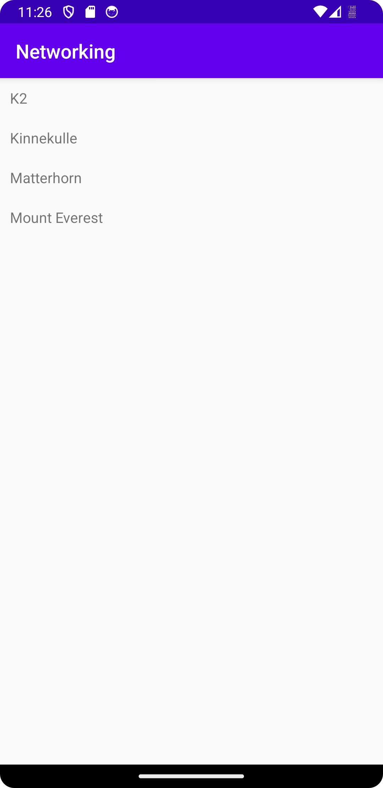

# Rapport

Jag började med att ge appen internet som vi gjort i tidigare inlämningar, sen implementerade jag en RecyclerView i dependencies som ligger i build.gradle. Detta för att kunna använda sig av Recycler View.
Därefter gjorde jag en klass Mountain som enbart hämtar namnen på bergen i i uppgiften. ToSring() metoden ratunerar en läsbar representation av ett objekt.

```
package com.example.networking; 
 
public class Mountain { 
    private String name; 
 
    public Mountain(String name){ 
 
        this.name = name; 
    } 
 
    public String getName(){ 
 
        return name; 
    } 
 
    public void setName (String name){ 
 
        this.name = name; 
    } 
 
 
    @Override 
    public String toString(){ 
 
        return name; 
    } 
} 
```
I MainActivity implementeras URL:en för att hämta datan vi vill visa i appen. I onCreate() talar vi om att URL:en ska hanteras av Json, vi använder sedan Gson för att översätta det till java-kod.

```
@Override 
public void onPostExecute(String json) { 
    Log.d("MainActivity", json); 
 
    Gson gson = new Gson();
    Type type = new TypeToken<List<Mountain>>() {}.getType(); 
    List<Mountain> ListOfMountains = gson.fromJson(json, type); 

 
```
Jag implementerade sedan en RecyclerView i activity_main som ska visa datan, till detta behövde jag en linearlayout med en vanlig TextView i.
Efter detta lade jag till klassen RecyclerViewAdapter som innehåller onClickListener m.m. I MainActivity onPostExecute() kopplas sedan RecyclerViewAdapter samman med RecyclerView för att kunna hämta datan i en View.

```
RecyclerViewAdapter adapter = new RecyclerViewAdapter(this, items, new RecyclerViewAdapter.OnClickListener() { 
            @Override 
            public void onClick(Mountain item) { 
                Toast.makeText(MainActivity.this, item.getName(), Toast.LENGTH_LONG).show(); 
            } 
        }); 
 
        RecyclerView recycler_view = findViewById(R.id.recycler_view); 
        recycler_view.setLayoutManager(new LinearLayoutManager(this)); 
        recycler_view.setAdapter(adapter); 
    } 
} 
```
Sedan skapar jag en ArrayList som innehåller värdena ifrån Mountain finns. Den datan som finns i ListOfMoutains kommer listas i RecyclerView, getName() metoden hämtar namnen på bergen.

```
ArrayList<Mountain> items = new ArrayList<>(); 
 
for (Mountain berg : ListOfMountains) { 
    Log.d("Mountain", berg.toString()); 
    items.add(new Mountain(berg.getName())); 
} 
```



